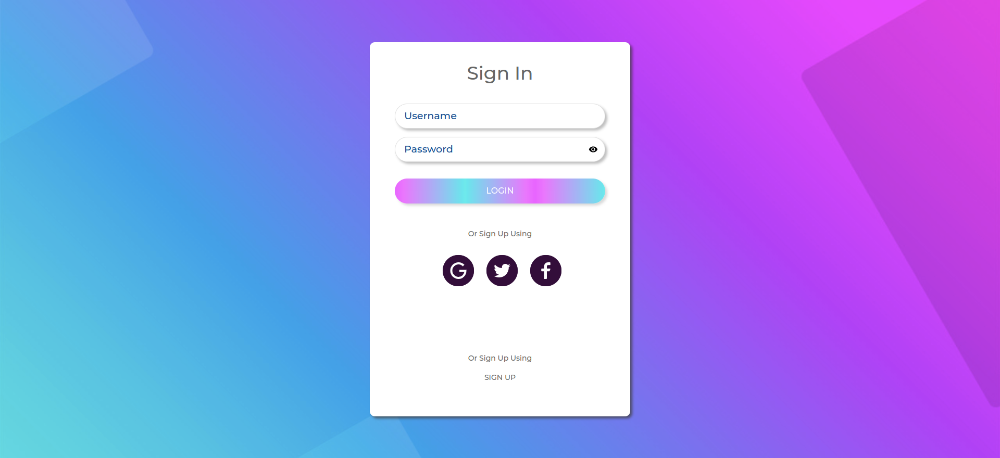

# Shoppy web app

Desarrollo frontend y backend de una web app estilo carrito de compras conectada a la pasarela de pagos stripe.

## Cómo funciona?

Requiere Node.JS 12

* `yarn` para instalar las dependencias.
* `yarn dev` para el entorno de desarrollo.
* `yarn build` para el entorno de producción.

## Licencia 

MIT
